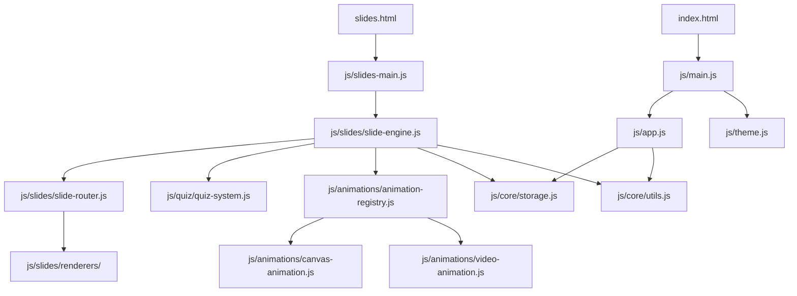

# 架构

## 模块依赖

## 渲染流程

1. `slides.html` 加载 `js/slides-main.js`
2. 实例化 `SlideEngine`，读取 `?chapter=&slide=` URL 参数
3. `loadJSON('data/chapters.json')` 拉取章节
4. 根据 slide `type` 通过 `SlideRouter` 派发到对应 renderer
5. `animation` 类型额外异步 mount canvas
6. `quiz` 类型额外 mount `QuizSystem`

## Storage 跨窗口同步

`Storage` 用内存缓存加速读；`window.addEventListener('storage', ...)` 监听其他窗口的写入并失效缓存。
