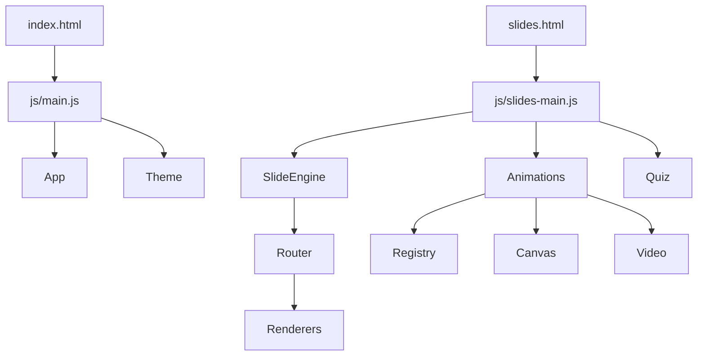

# Phase 1: 架构地基与 Bug 修复 实施计划

> **For agentic workers:** REQUIRED SUB-SKILL: Use superpowers:subagent-driven-development (recommended) or superpowers:executing-plans to implement this plan task-by-task. Steps use checkbox (`- [ ]`) syntax for tracking.

**Goal:** 把当前"全局污染 + 单文件 642 行 + 硬编码动画"重构为可扩展 ES Modules 架构，修复已识别紧急 Bug，建立视频动画接口约定；用户视角功能完全等价。

**Architecture:** 拆分 `slides.js` 单文件 → 路由器 + 9 个独立渲染器 + 内容解析器 + 代码高亮器。引入 `AnimationRegistry`（Map）做动画自注册，`<video onerror>` 做视频回退。Storage 加内存缓存 + `storage` 事件跨窗口失效。所有 JS 改 ES Modules，`slides.html` 只 import 一个入口模块。

**Tech Stack:** 纯静态 HTML/CSS/JS，ES Modules。开发期引入 Vitest + jsdom（devDependency，不进产物）。**运行需本地 HTTP 服务器**（如 `python3 -m http.server`）——`file://` 协议下 fetch 与 ES Modules 均被 CORS 拦截。

**前置依赖:** 无（首阶段）。
**后续依赖:** Phase 2 依赖本阶段的 AnimationRegistry、CanvasAnimation 基类、chapters.json schema 扩展。

---

## Task 1: 测试基础设施

**Files:**
- Create: `package.json`
- Create: `vitest.config.js`
- Create: `tests/setup.js`
- Create: `.gitignore`

- [ ] **Step 1: 写 package.json**

```json
{
  "name": "hello-agents-ppt",
  "version": "1.0.0",
  "type": "module",
  "private": true,
  "scripts": {
    "test": "vitest run",
    "test:watch": "vitest",
    "start": "python3 -m http.server 8080"
  },
  "devDependencies": {
    "vitest": "^1.6.0",
    "jsdom": "^24.0.0"
  }
}
```

- [ ] **Step 2: 写 vitest.config.js**

```js
import { defineConfig } from 'vitest/config';

export default defineConfig({
    test: {
        environment: 'jsdom',
        globals: false,
        include: ['tests/**/*.test.js'],
        setupFiles: ['./tests/setup.js']
    }
});
```

- [ ] **Step 3: 写 tests/setup.js**

```js
// 全局测试 setup：每个测试前清空 DOM 和 localStorage
import { afterEach } from 'vitest';

afterEach(() => {
    document.body.innerHTML = '';
    localStorage.clear();
});
```

- [ ] **Step 4: 写 .gitignore**

```
node_modules/
.DS_Store
*.log
.omc/
.codegraph/
```

- [ ] **Step 5: 安装并验证测试能跑**

```bash
cd /home/anan/桌面/hello-agents-ppt && npm install
npm test
```

Expected: 无测试文件、Vitest 输出 "No test files found" 退出码 0。

- [ ] **Step 6: Commit**

```bash
git add package.json vitest.config.js tests/setup.js .gitignore
git commit -m "chore: add vitest test infrastructure"
```

---

## Task 2: 重写 Storage 模块（带缓存 + 跨窗口失效）

**Files:**
- Create: `js/core/storage.js`
- Test: `tests/core/storage.test.js`

- [ ] **Step 1: 写失败测试（缓存基础）**

```js
// tests/core/storage.test.js
import { describe, it, expect, beforeEach, vi } from 'vitest';
import { Storage, STORAGE_KEY } from '../../js/core/storage.js';

describe('Storage', () => {
    beforeEach(() => {
        localStorage.clear();
        Storage._resetCache();
    });

    it('get() returns defaults when localStorage is empty', () => {
        const data = Storage.get();
        expect(data.theme).toBe('light');
        expect(data.chapters).toEqual({});
    });

    it('set() persists to localStorage', () => {
        Storage.set({ theme: 'dark', chapters: {} });
        const raw = localStorage.getItem(STORAGE_KEY);
        expect(JSON.parse(raw).theme).toBe('dark');
    });

    it('get() uses cache after first call (no repeated JSON.parse)', () => {
        const spy = vi.spyOn(Storage, '_readRaw');
        Storage.get();
        Storage.get();
        Storage.get();
        expect(spy).toHaveBeenCalledTimes(1);
    });

    it('invalidateCache() forces re-read on next get()', () => {
        Storage.get();
        Storage.invalidateCache();
        Storage.get();
        expect(Storage._readRaw).toHaveBeenCalledTimes(2);
    });

    it('getChapterProgress returns default for unknown chapter', () => {
        const p = Storage.getChapterProgress('ch99');
        expect(p).toEqual({ completed: false, slideIndex: 0, quizScore: 0 });
    });

    it('setChapterProgress merges with existing', () => {
        Storage.setChapterProgress('ch1', { slideIndex: 3 });
        Storage.setChapterProgress('ch1', { completed: true });
        const p = Storage.getChapterProgress('ch1');
        expect(p.slideIndex).toBe(3);
        expect(p.completed).toBe(true);
    });

    it('storage event invalidates cache', () => {
        Storage.get();
        // 模拟其他窗口写入
        localStorage.setItem(STORAGE_KEY, JSON.stringify({
            theme: 'dark', chapters: {}, settings: { animationSpeed: 1, showNotes: true, autoPlay: false }
        }));
        window.dispatchEvent(new StorageEvent('storage', { key: STORAGE_KEY }));
        expect(Storage.get().theme).toBe('dark');
    });
});
```

- [ ] **Step 2: 跑测试确认失败**

```bash
npm test -- tests/core/storage.test.js
```

Expected: FAIL — `Cannot find module '../../js/core/storage.js'`

- [ ] **Step 3: 实现 storage.js**

```js
// js/core/storage.js
export const STORAGE_KEY = 'hello-agents-ppt';

const defaultState = {
    theme: 'light',
    lastChapter: null,
    lastSlide: 0,
    chapters: {},
    settings: { animationSpeed: 1, showNotes: true, autoPlay: false }
};

let _cache = null;

export const Storage = {
    _readRaw() {
        return localStorage.getItem(STORAGE_KEY);
    },

    _resetCache() { _cache = null; },
    invalidateCache() { _cache = null; },

    get() {
        if (_cache === null) {
            const raw = this._readRaw();
            _cache = raw ? { ...defaultState, ...JSON.parse(raw) } : { ...defaultState };
        }
        return _cache;
    },

    set(data) {
        _cache = { ...defaultState, ...data };
        localStorage.setItem(STORAGE_KEY, JSON.stringify(_cache));
    },

    getChapterProgress(chapterId) {
        const state = this.get();
        return state.chapters[chapterId] || { completed: false, slideIndex: 0, quizScore: 0 };
    },

    setChapterProgress(chapterId, progress) {
        const state = this.get();
        state.chapters[chapterId] = { ...this.getChapterProgress(chapterId), ...progress };
        this.set(state);
    },

    setLastVisited(chapterId, slideIndex) {
        const state = this.get();
        state.lastChapter = chapterId;
        state.lastSlide = slideIndex;
        this.set(state);
    },

    getLastVisited() {
        const state = this.get();
        return { chapterId: state.lastChapter, slideIndex: state.lastSlide };
    },

    getTheme() { return this.get().theme; },

    setTheme(theme) {
        const state = this.get();
        state.theme = theme;
        this.set(state);
        document.documentElement.setAttribute('data-theme', theme);
    },

    reset() {
        _cache = null;
        localStorage.removeItem(STORAGE_KEY);
    },

    getOverallProgress(chapterIds) {
        const state = this.get();
        if (!chapterIds.length) return 0;
        const completed = chapterIds.filter(id => state.chapters[id]?.completed).length;
        return Math.round((completed / chapterIds.length) * 100);
    }
};

// 跨窗口缓存失效：其他窗口写入时让本窗口缓存作废
if (typeof window !== 'undefined') {
    window.addEventListener('storage', (e) => {
        if (e.key === STORAGE_KEY) _cache = null;
    });
    // 启动时从 localStorage 同步一次 theme
    const theme = Storage.getTheme();
    document.documentElement.setAttribute('data-theme', theme);
}
```

- [ ] **Step 4: 跑测试确认通过**

```bash
npm test -- tests/core/storage.test.js
```

Expected: 7/7 PASS

- [ ] **Step 5: Commit**

```bash
git add js/core/storage.js tests/core/storage.test.js
git commit -m "feat(core): Storage with memory cache + storage event invalidation"
```

---

## Task 3: 工具函数（utils.js，命名导出）

**Files:**
- Create: `js/core/utils.js`
- Test: `tests/core/utils.test.js`

- [ ] **Step 1: 写失败测试**

```js
// tests/core/utils.test.js
import { describe, it, expect } from 'vitest';
import { $, $$, createElement, escapeHTML, throttle, debounce, loadJSON, getURLParams } from '../../js/core/utils.js';

describe('utils', () => {
    it('$ finds element', () => {
        document.body.innerHTML = '<div id="x"></div>';
        expect($('#x').id).toBe('x');
    });

    it('$$ returns array', () => {
        document.body.innerHTML = '<span class="y"></span><span class="y"></span>';
        expect($$('.y').length).toBe(2);
    });

    it('createElement handles className, dataset, children', () => {
        const el = createElement('div', { className: 'a b', dataset: { k: 'v' } }, 'hello', ' ', 'world');
        expect(el.className).toBe('a b');
        expect(el.dataset.k).toBe('v');
        expect(el.textContent).toBe('hello world');
    });

    it('escapeHTML escapes <, >, &, "', () => {
        expect(escapeHTML('<a href="x">"&</a>')).toBe('&lt;a href=&quot;x&quot;&gt;&quot;&amp;&lt;/a&gt;');
    });

    it('throttle limits calls', () => {
        let n = 0;
        const f = throttle(() => n++, 50);
        f(); f(); f();
        expect(n).toBe(1);
    });

    it('debounce delays call', async () => {
        let n = 0;
        const f = debounce(() => n++, 30);
        f(); f(); f();
        await new Promise(r => setTimeout(r, 60));
        expect(n).toBe(1);
    });

    it('loadJSON fetches and parses', async () => {
        globalThis.fetch = () => Promise.resolve({
            ok: true,
            json: () => Promise.resolve({ a: 1 })
        });
        const data = await loadJSON('x.json');
        expect(data).toEqual({ a: 1 });
    });

    it('loadJSON throws on non-ok', async () => {
        globalThis.fetch = () => Promise.resolve({ ok: false, status: 404 });
        await expect(loadJSON('x.json')).rejects.toThrow('404');
    });

    it('getURLParams parses query string', () => {
        const original = window.location;
        delete window.location;
        window.location = { ...original, search: '?chapter=ch1&slide=3' };
        const p = getURLParams();
        window.location = original;
        expect(p).toEqual({ chapter: 'ch1', slide: '3' });
    });
});
```

- [ ] **Step 2: 跑测试确认失败**

```bash
npm test -- tests/core/utils.test.js
```

Expected: FAIL — module not found

- [ ] **Step 3: 实现 utils.js**

```js
// js/core/utils.js

export const $ = (selector, context = document) => context.querySelector(selector);

export const $$ = (selector, context = document) => Array.from(context.querySelectorAll(selector));

export function createElement(tag, attrs = {}, ...children) {
    const el = document.createElement(tag);
    Object.entries(attrs).forEach(([key, val]) => {
        if (key === 'className') el.className = val;
        else if (key === 'dataset') Object.assign(el.dataset, val);
        else if (key.startsWith('on') && typeof val === 'function') {
            el.addEventListener(key.slice(2).toLowerCase(), val);
        } else {
            el.setAttribute(key, val);
        }
    });
    children.forEach(child => {
        if (typeof child === 'string') el.appendChild(document.createTextNode(child));
        else if (child) el.appendChild(child);
    });
    return el;
}

export function escapeHTML(str) {
    const div = document.createElement('div');
    div.textContent = str;
    return div.innerHTML;
}

export function throttle(fn, delay) {
    let lastTime = 0;
    return function(...args) {
        const now = Date.now();
        if (now - lastTime >= delay) {
            lastTime = now;
            fn.apply(this, args);
        }
    };
}

export function debounce(fn, delay) {
    let timer;
    return function(...args) {
        clearTimeout(timer);
        timer = setTimeout(() => fn.apply(this, args), delay);
    };
}

export async function loadJSON(url) {
    const response = await fetch(url);
    if (!response.ok) throw new Error(`Failed to load ${url}: ${response.status}`);
    return response.json();
}

export function getURLParams() {
    return Object.fromEntries(new URLSearchParams(window.location.search).entries());
}
```

- [ ] **Step 4: 跑测试确认通过**

```bash
npm test -- tests/core/utils.test.js
```

Expected: 9/9 PASS

- [ ] **Step 5: Commit**

```bash
git add js/core/utils.js tests/core/utils.test.js
git commit -m "feat(core): utility functions as ES modules"
```

---

## Task 4: 内容解析器（content-parser.js）

**Files:**
- Create: `js/core/content-parser.js`
- Test: `tests/core/content-parser.test.js`

- [ ] **Step 1: 写失败测试**

```js
// tests/core/content-parser.test.js
import { describe, it, expect } from 'vitest';
import { ContentParser } from '../../js/core/content-parser.js';

describe('ContentParser', () => {
    const p = new ContentParser();

    it('parses simple paragraph', () => {
        expect(p.parse('hello world')).toBe('<p>hello world</p>');
    });

    it('parses bullet list', () => {
        const md = '• a\n• b\n• c';
        const html = p.parse(md);
        expect(html).toContain('<ul class="bullet-points">');
        expect(html).toContain('<li>a</li>');
        expect(html).toContain('<li>c</li>');
    });

    it('parses numbered list', () => {
        const md = '1. one\n2. two\n3. three';
        const html = p.parse(md);
        expect(html).toContain('<ol class="bullet-points">');
        expect(html).toContain('<li>one</li>');
    });

    it('parses info box', () => {
        const html = p.parse('[提示] 这是提示');
        expect(html).toContain('info-box');
        expect(html).toContain('这是提示');
    });

    it('parses warning box', () => {
        expect(p.parse('[警告] 危险').match(/warning-box/)).toBeTruthy();
    });

    it('parses success box', () => {
        expect(p.parse('[成功] 好的').match(/success-box/)).toBeTruthy();
    });

    it('parses table with separator row', () => {
        const md = '| A | B |\n|---|---|\n| 1 | 2 |';
        const html = p.parse(md);
        expect(html).toContain('<table');
        expect(html).toContain('<th>A</th>');
        expect(html).toContain('<td>1</td>');
    });

    it('inline **bold** renders <strong>', () => {
        expect(p.parse('**important**')).toContain('<strong>important</strong>');
    });

    it('inline `code` renders <code>', () => {
        expect(p.parse('use `x()`')).toContain('<code class="inline-code">x()</code>');
    });

    it('escapes HTML in content', () => {
        const html = p.parse('<script>alert(1)</script>');
        expect(html).not.toContain('<script>');
        expect(html).toContain('&lt;script&gt;');
    });
});
```

- [ ] **Step 2: 跑测试确认失败**

```bash
npm test -- tests/core/content-parser.test.js
```

Expected: FAIL — module not found

- [ ] **Step 3: 实现 content-parser.js**

```js
// js/core/content-parser.js
import { escapeHTML } from './utils.js';

export class ContentParser {
    parse(content) {
        if (content == null) return '';
        if (typeof content !== 'string') return String(content);
        const lines = content.split('\n');
        let html = '';
        let listBuffer = [];
        let listType = null;

        const flushList = () => {
            if (!listBuffer.length) return;
            if (listType === 'table') {
                html += this._renderTable(listBuffer);
            } else {
                const tag = listType === 'ol' ? 'ol' : 'ul';
                html += `<${tag} class="bullet-points">${listBuffer.map(li => `<li>${this._inline(li)}</li>`).join('')}</${tag}>`;
            }
            listBuffer = [];
            listType = null;
        };

        for (let raw of lines) {
            const line = raw.replace(/\r$/, '');
            const trimmed = line.trim();

            if (/^\s*\|.*\|\s*$/.test(line)) {
                if (listType !== 'table') flushList();
                listType = 'table';
                listBuffer.push(trimmed);
                continue;
            }

            const bulletMatch = trimmed.match(/^([-•*])\s+(.+)$/) || trimmed.match(/^(\d+)[.)、]\s+(.+)$/);
            if (bulletMatch) {
                const type = /^\d+[.)、]/.test(trimmed) ? 'ol' : 'ul';
                if (listType !== type) flushList();
                listType = type;
                listBuffer.push(bulletMatch[2]);
                continue;
            }

            if (!trimmed) { flushList(); continue; }

            flushList();

            const boxMatch = trimmed.match(/^\[(提示|注意|警告|重要|成功)\]\s*(.+)$/);
            if (boxMatch) {
                const [, level, text] = boxMatch;
                const cls = /警告|注意/.test(level) ? 'warning-box' : /成功/.test(level) ? 'success-box' : 'info-box';
                html += `<div class="${cls}">${this._inline(text)}</div>`;
                continue;
            }

            html += `<p>${this._inline(trimmed)}</p>`;
        }
        flushList();
        return html;
    }

    _inline(text) {
        return escapeHTML(text)
            .replace(/\*\*(.+?)\*\*/g, '<strong>$1</strong>')
            .replace(/`([^`]+)`/g, '<code class="inline-code">$1</code>');
    }

    _renderTable(rows) {
        const clean = rows.map(r => r.replace(/^\s*\|/, '').replace(/\|\s*$/, '').split('|').map(c => c.trim()));
        const isSep = (row) => row.every(c => /^[-:]+$/.test(c));
        const body = clean.filter(r => !isSep(r));
        if (!body.length) return '';
        const [head, ...rest] = body;
        return `<table class="comparison-table"><thead><tr>${head.map(h => `<th>${this._inline(h)}</th>`).join('')}</tr></thead><tbody>${rest.map(r => `<tr>${r.map(c => `<td>${this._inline(c)}</td>`).join('')}</tr>`).join('')}</tbody></table>`;
    }
}
```

- [ ] **Step 4: 跑测试确认通过**

```bash
npm test -- tests/core/content-parser.test.js
```

Expected: 10/10 PASS

- [ ] **Step 5: Commit**

```bash
git add js/core/content-parser.js tests/core/content-parser.test.js
git commit -m "feat(core): ContentParser as ES module"
```

---

## Task 5: 代码高亮器（修复正则 bug）

**Files:**
- Create: `js/core/code-highlighter.js`
- Test: `tests/core/code-highlighter.test.js`

- [ ] **Step 1: 写失败测试**

```js
// tests/core/code-highlighter.test.js
import { describe, it, expect } from 'vitest';
import { highlightCode } from '../../js/core/code-highlighter.js';

describe('highlightCode', () => {
    it('highlights Python keywords', () => {
        const html = highlightCode('def foo():', 'python');
        expect(html).toMatch(/<span class="kw">def<\/span>\s*<span class="kw">foo<\/span>/);
    });

    it('highlights Python comments', () => {
        const html = highlightCode('# comment', 'python');
        expect(html).toContain('<span class="comment"># comment</span>');
    });

    it('highlights Python strings', () => {
        const html = highlightCode('"hello"', 'python');
        expect(html).toContain('<span class="str">&quot;hello&quot;</span>');
    });

    it('highlights numbers', () => {
        const html = highlightCode('x = 42', 'python');
        expect(html).toContain('<span class="num">42</span>');
    });

    it('handles JS keywords', () => {
        const html = highlightCode('const x = 1;', 'js');
        expect(html).toContain('<span class="kw">const</span>');
    });

    it('handles JSON', () => {
        const html = highlightCode('{"a": 1}', 'json');
        expect(html).toContain('<span class="str">&quot;a&quot;</span>');
    });

    it('handles unknown language as generic', () => {
        const html = highlightCode('# comment\n// other', 'unknown');
        expect(html).toContain('<span class="comment">');
    });

    it('returns empty string for null', () => {
        expect(highlightCode(null, 'python')).toBe('');
    });

    it('escapes HTML to prevent XSS', () => {
        const html = highlightCode('<script>', 'python');
        expect(html).not.toContain('<script>');
        expect(html).toContain('&lt;script&gt;');
    });
});
```

- [ ] **Step 2: 跑测试确认失败**

```bash
npm test -- tests/core/code-highlighter.test.js
```

Expected: FAIL

- [ ] **Step 3: 实现 code-highlighter.js**

实现要点：用 token 化而非简单多次 replace，避免字符串/注释/关键字相互污染。

```js
// js/core/code-highlighter.js
import { escapeHTML } from './utils.js';

const KEYWORDS = {
    python: ['class','def','return','if','elif','else','for','while','in','import','from','as','with','try','except','finally','True','False','None','self','pass','break','continue','lambda','yield','async','await','not','and','or','is','print','raise','global','nonlocal'],
    js: ['function','class','const','let','var','return','if','else','for','while','new','this','async','await','try','catch','throw','true','false','null','undefined','import','from','export','default','typeof','instanceof']
};

export function highlightCode(code, language) {
    if (!code) return '';
    let html = escapeHTML(code);

    if (language === 'json') {
        html = html.replace(/(&quot;[^&]+&quot;)\s*:/g, '<span class="kw">$1</span>:');
        html = html.replace(/:\s*(&quot;[^&]*&quot;)/g, ': <span class="str">$1</span>');
        html = html.replace(/\b(true|false|null)\b/g, '<span class="comment">$1</span>');
        html = html.replace(/\b(\d+)\b/g, '<span class="num">$1</span>');
        return html;
    }

    const isPy = language === 'python' || language === 'py';
    const isJs = language === 'javascript' || language === 'js' || language === 'ts' || language === 'typescript';

    if (isPy) {
        html = html.replace(/(#[^\n]*)/g, '<span class="comment">$1</span>');
        html = html.replace(/(&quot;[^&]*&quot;|&#39;[^&]*&#39;)/g, '<span class="str">$1</span>');
    } else if (isJs) {
        html = html.replace(/(\/\/[^\n]*)/g, '<span class="comment">$1</span>');
        html = html.replace(/(&quot;[^&]*&quot;|&#39;[^&]*&#39;)/g, '<span class="str">$1</span>');
    } else {
        html = html.replace(/(\/\/[^\n]*|#[^\n]*)/g, '<span class="comment">$1</span>');
        html = html.replace(/(&quot;[^&]*&quot;|&#39;[^&]*&#39;)/g, '<span class="str">$1</span>');
    }

    const keywords = isPy ? KEYWORDS.python : isJs ? KEYWORDS.js : [];
    if (keywords.length) {
        const re = new RegExp(`\\b(${keywords.join('|')})\\b`, 'g');
        html = html.replace(re, '<span class="kw">$1</span>');
    }

    html = html.replace(/\b(\d+)\b/g, '<span class="num">$1</span>');
    return html;
}
```

- [ ] **Step 4: 跑测试确认通过**

```bash
npm test -- tests/core/code-highlighter.test.js
```

Expected: 9/9 PASS

- [ ] **Step 5: Commit**

```bash
git add js/core/code-highlighter.js tests/core/code-highlighter.test.js
git commit -m "feat(core): code highlighter with XSS-safe escaping"
```

---

## Task 6: 动画注册中心

**Files:**
- Create: `js/animations/animation-registry.js`
- Test: `tests/animations/animation-registry.test.js`

- [ ] **Step 1: 写失败测试**

```js
// tests/animations/animation-registry.test.js
import { describe, it, expect, beforeEach } from 'vitest';
import { AnimationRegistry, registerAnimation, getAnimation, _resetRegistry } from '../../js/animations/animation-registry.js';

describe('AnimationRegistry', () => {
    beforeEach(() => _resetRegistry());

    it('registerAnimation + getAnimation returns factory', () => {
        const factory = () => ({ name: 'x' });
        registerAnimation('ch1', factory);
        expect(getAnimation('ch1')).toBe(factory);
    });

    it('getAnimation returns undefined for unknown id', () => {
        expect(getAnimation('unknown')).toBeUndefined();
    });

    it('registerAnimation overwrites existing id', () => {
        registerAnimation('ch1', () => 'a');
        registerAnimation('ch1', () => 'b');
        expect(getAnimation('ch1')().toBe('b')).toBe(true);
    });
});
```

- [ ] **Step 2: 跑测试确认失败**

```bash
npm test -- tests/animations/animation-registry.test.js
```

Expected: FAIL

- [ ] **Step 3: 实现 animation-registry.js**

```js
// js/animations/animation-registry.js
export const AnimationRegistry = new Map();

export function registerAnimation(id, factory) {
    AnimationRegistry.set(id, factory);
}

export function getAnimation(id) {
    return AnimationRegistry.get(id);
}

export function _resetRegistry() {
    AnimationRegistry.clear();
}
```

- [ ] **Step 4: 跑测试确认通过**

```bash
npm test -- tests/animations/animation-registry.test.js
```

Expected: 3/3 PASS

- [ ] **Step 5: Commit**

```bash
git add js/animations/animation-registry.js tests/animations/animation-registry.test.js
git commit -m "feat(animations): registry for self-registering animations"
```

---

## Task 7: CanvasAnimation 基类

**Files:**
- Create: `js/animations/canvas-animation.js`
- Test: `tests/animations/canvas-animation.test.js`

- [ ] **Step 1: 写失败测试**

```js
// tests/animations/canvas-animation.test.js
import { describe, it, expect, beforeEach, vi } from 'vitest';
import { CanvasAnimation } from '../../js/animations/canvas-animation.js';

class TestAnim extends CanvasAnimation {
    init(canvas) { this.canvas = canvas; this._resize(); }
    draw() { this.drawn = true; }
    play() {}
    pause() {}
    step() {}
    reset() {}
    setSpeed(v) { this.speed = v; }
}

describe('CanvasAnimation', () => {
    let canvas;
    beforeEach(() => {
        document.body.innerHTML = '<div id="c" style="width:400px;height:300px"><canvas></canvas></div>';
        canvas = document.querySelector('canvas');
    });

    it('reads DPR-aware logical size', () => {
        const a = new TestAnim();
        a.init(canvas);
        expect(a.width).toBe(400);
        expect(a.height).toBe(300);
        expect(a.canvas.width).toBe(400 * (window.devicePixelRatio || 1));
    });

    it('isDarkTheme() reads data-theme attribute', () => {
        document.documentElement.setAttribute('data-theme', 'dark');
        const a = new TestAnim();
        expect(a.isDarkTheme()).toBe(true);
        document.documentElement.setAttribute('data-theme', 'light');
        expect(a.isDarkTheme()).toBe(false);
    });

    it('roundRect draws rounded path', () => {
        const a = new TestAnim();
        a.init(canvas);
        const ctx = canvas.getContext('2d');
        const spy = vi.spyOn(ctx, 'quadraticCurveTo');
        a.roundRect(ctx, 10, 10, 100, 50, 5);
        expect(spy).toHaveBeenCalled();
    });

    it('wrapText splits long text into lines', () => {
        const a = new TestAnim();
        a.init(canvas);
        const ctx = canvas.getContext('2d');
        ctx.measureText = (t) => ({ width: t.length * 20 });
        const lines = a.wrapText(ctx, 'abcdef', 0, 0, 50, 16);
        expect(lines.length).toBeGreaterThan(1);
    });
});
```

- [ ] **Step 2: 跑测试确认失败**

```bash
npm test -- tests/animations/canvas-animation.test.js
```

Expected: FAIL

- [ ] **Step 3: 实现 canvas-animation.js**

```js
// js/animations/canvas-animation.js
export class CanvasAnimation {
    constructor() {
        this.canvas = null;
        this.ctx = null;
        this.width = 0;
        this.height = 0;
    }

    init(canvas) {
        this.canvas = canvas;
        this.ctx = canvas.getContext('2d');
        this._resize();
    }

    _resize() {
        if (!this.canvas) return;
        const container = this.canvas.parentElement;
        const dpr = window.devicePixelRatio || 1;
        const w = container.clientWidth || 800;
        const h = container.clientHeight || 420;
        this.canvas.style.width = w + 'px';
        this.canvas.style.height = h + 'px';
        this.canvas.width = w * dpr;
        this.canvas.height = h * dpr;
        this.ctx.setTransform(dpr, 0, 0, dpr, 0, 0);
        this.width = w;
        this.height = h;
    }

    isDarkTheme() {
        return document.documentElement.getAttribute('data-theme') === 'dark';
    }

    roundRect(ctx, x, y, w, h, r) {
        ctx.beginPath();
        ctx.moveTo(x + r, y);
        ctx.lineTo(x + w - r, y);
        ctx.quadraticCurveTo(x + w, y, x + w, y + r);
        ctx.lineTo(x + w, y + h - r);
        ctx.quadraticCurveTo(x + w, y + h, x + w - r, y + h);
        ctx.lineTo(x + r, y + h);
        ctx.quadraticCurveTo(x, y + h, x, y + h - r);
        ctx.lineTo(x, y + r);
        ctx.quadraticCurveTo(x, y, x + r, y);
        ctx.closePath();
    }

    wrapText(ctx, text, x, y, maxWidth, lineHeight) {
        const words = text.split('');
        let line = '';
        const lines = [];
        for (let n = 0; n < words.length; n++) {
            const testLine = line + words[n];
            if (ctx.measureText(testLine).width > maxWidth && n > 0) {
                lines.push(line);
                line = words[n];
            } else {
                line = testLine;
            }
        }
        lines.push(line);
        return lines;
    }
}
```

- [ ] **Step 4: 跑测试确认通过**

```bash
npm test -- tests/animations/canvas-animation.test.js
```

Expected: 4/4 PASS

- [ ] **Step 5: Commit**

```bash
git add js/animations/canvas-animation.js tests/animations/canvas-animation.test.js
git commit -m "feat(animations): CanvasAnimation base class with DPR + dark theme"
```

---

## Task 8: VideoAnimation 视频回退类

**Files:**
- Create: `js/animations/video-animation.js`
- Test: `tests/animations/video-animation.test.js`

- [ ] **Step 1: 写失败测试**

```js
// tests/animations/video-animation.test.js
import { describe, it, expect, beforeEach, vi } from 'vitest';
import { VideoAnimation } from '../../js/animations/video-animation.js';

describe('VideoAnimation', () => {
    beforeEach(() => { document.body.innerHTML = ''; });

    it('init creates <video> with provided src', () => {
        document.body.innerHTML = '<div id="c"></div>';
        const a = new VideoAnimation('foo.mp4', () => null);
        a.init(document.getElementById('c'));
        const v = a.video;
        expect(v.tagName).toBe('VIDEO');
        expect(v.src).toContain('foo.mp4');
    });

    it('on error calls fallback factory and applies it', () => {
        document.body.innerHTML = '<div id="c"></div>';
        const fallback = { init: vi.fn() };
        const a = new VideoAnimation('missing.mp4', () => fallback);
        a.init(document.getElementById('c'));
        a.video.dispatchEvent(new Event('error'));
        expect(fallback.init).toHaveBeenCalled();
        expect(a.currentAnim).toBe(fallback);
    });

    it('play/pause delegate to video or fallback', () => {
        document.body.innerHTML = '<div id="c"></div>';
        const a = new VideoAnimation('x.mp4', () => null);
        a.init(document.getElementById('c'));
        const spy = vi.spyOn(a.video, 'play').mockResolvedValue();
        a.play();
        expect(spy).toHaveBeenCalled();
    });
});
```

- [ ] **Step 2: 跑测试确认失败**

```bash
npm test -- tests/animations/video-animation.test.js
```

Expected: FAIL

- [ ] **Step 3: 实现 video-animation.js**

```js
// js/animations/video-animation.js
export class VideoAnimation {
    constructor(src, fallbackFactory) {
        this.src = src;
        this.fallbackFactory = fallbackFactory;
        this.video = null;
        this.currentAnim = null;
    }

    init(container) {
        const video = document.createElement('video');
        video.src = `assets/animations/${this.src}`;
        video.preload = 'none';
        video.controls = false;
        video.style.width = '100%';
        video.style.height = '100%';
        video.addEventListener('error', () => this._tryFallback(container));
        container.appendChild(video);
        this.video = video;
    }

    _tryFallback(container) {
        if (this.fallbackFactory) {
            const fb = this.fallbackFactory();
            if (fb) {
                this.currentAnim = fb;
                this.video.style.display = 'none';
                const canvas = document.createElement('canvas');
                canvas.style.width = '100%';
                canvas.style.height = '100%';
                container.appendChild(canvas);
                fb.init(canvas);
            }
        }
    }

    play() { return this.currentAnim ? this.currentAnim.play?.() : this.video?.play(); }
    pause() { return this.currentAnim ? this.currentAnim.pause?.() : this.video?.pause(); }
    step() { return this.currentAnim?.step?.(); }
    reset() { this.video.currentTime = 0; return this.currentAnim?.reset?.(); }
    setSpeed(v) {
        if (this.video) this.video.playbackRate = v;
        return this.currentAnim?.setSpeed?.(v);
    }
    isPlaying() { return this.currentAnim ? !!this.currentAnim.isPlaying?.() : !this.video.paused; }
}
```

- [ ] **Step 4: 跑测试确认通过**

```bash
npm test -- tests/animations/video-animation.test.js
```

Expected: 3/3 PASS

- [ ] **Step 5: Commit**

```bash
git add js/animations/video-animation.js tests/animations/video-animation.test.js
git commit -m "feat(animations): VideoAnimation with fallback to canvas"
```

---

## Task 9: SlideRouter

**Files:**
- Create: `js/slides/slide-router.js`
- Test: `tests/slides/slide-router.test.js`

- [ ] **Step 1: 写失败测试**

```js
// tests/slides/slide-router.test.js
import { describe, it, expect } from 'vitest';
import { SlideRouter } from '../../js/slides/slide-router.js';

describe('SlideRouter', () => {
    it('registers and routes to handler', () => {
        const router = new SlideRouter();
        const handler = (slide, ctx) => 'result';
        router.register('cover', handler);
        expect(router.route({ type: 'cover' }, { chapter: {} })).toBe('result');
    });

    it('returns empty string for unknown type', () => {
        const router = new SlideRouter();
        expect(router.route({ type: 'unknown' }, { chapter: {} })).toBe('');
    });

    it('defaultFallback overrides empty return for unknown types', () => {
        const router = new SlideRouter();
        router.defaultFallback = (s, ctx) => `fallback:${s.type}`;
        expect(router.route({ type: 'mystery' }, { chapter: {} })).toBe('fallback:mystery');
    });
});
```

- [ ] **Step 2: 跑测试确认失败**

```bash
npm test -- tests/slides/slide-router.test.js
```

Expected: FAIL

- [ ] **Step 3: 实现 slide-router.js**

```js
// js/slides/slide-router.js
export class SlideRouter {
    constructor() {
        this.handlers = new Map();
        this.defaultFallback = null;
    }

    register(type, handler) {
        this.handlers.set(type, handler);
    }

    route(slide, ctx) {
        const handler = this.handlers.get(slide.type);
        if (handler) return handler(slide, ctx);
        if (this.defaultFallback) return this.defaultFallback(slide, ctx);
        console.warn(`No renderer for slide type: ${slide.type}`);
        return '';
    }
}
```

- [ ] **Step 4: 跑测试确认通过**

```bash
npm test -- tests/slides/slide-router.test.js
```

Expected: 3/3 PASS

- [ ] **Step 5: Commit**

```bash
git add js/slides/slide-router.js tests/slides/slide-router.test.js
git commit -m "feat(slides): SlideRouter with type-keyed handler registry"
```

---

## Task 10: 各 slide 渲染器（9 个文件，统一接口）

**Files:**
- Create: `js/slides/renderers/cover.js`
- Create: `js/slides/renderers/content.js`
- Create: `js/slides/renderers/code.js`
- Create: `js/slides/renderers/quiz.js`
- Create: `js/slides/renderers/animation.js`
- Create: `js/slides/renderers/timeline.js`
- Create: `js/slides/renderers/flow.js`
- Create: `js/slides/renderers/concepts.js`
- Create: `js/slides/renderers/comparison.js`
- Test: `tests/slides/renderers.test.js`

所有渲染器遵循统一签名：`(slide, ctx) => string` —— 接收 slide 数据和上下文（含 chapterData, slideIndex, slidesLength），返回 HTML 字符串。

- [ ] **Step 1: 写测试**

```js
// tests/slides/renderers.test.js
import { describe, it, expect } from 'vitest';
import { renderCover } from '../../js/slides/renderers/cover.js';
import { renderContent } from '../../js/slides/renderers/content.js';
import { renderCode } from '../../js/slides/renderers/code.js';
import { renderTimeline } from '../../js/slides/renderers/timeline.js';
import { renderFlow } from '../../js/slides/renderers/flow.js';
import { renderConcepts } from '../../js/slides/renderers/concepts.js';
import { renderComparison } from '../../js/slides/renderers/comparison.js';
import { renderQuiz } from '../../js/slides/renderers/quiz.js';
import { renderAnimation } from '../../js/slides/renderers/animation.js';

const ctx = { chapterData: { icon: '📖', title: 'T', subtitle: 'S' }, slidesLength: 3 };

describe('renderers', () => {
    it('renderCover', () => {
        const html = renderCover({ type: 'cover', title: 'T', subtitle: 'S' }, ctx);
        expect(html).toContain('slide-cover');
        expect(html).toContain('<h1>T</h1>');
    });

    it('renderContent', () => {
        const html = renderContent({ type: 'content', title: 'X', content: 'para' }, { ...ctx, slideIndex: 1 });
        expect(html).toContain('第 2 页');
        expect(html).toContain('X');
        expect(html).toContain('<p>para</p>');
    });

    it('renderCode', () => {
        const html = renderCode({ type: 'code', title: 'C', language: 'python', code: 'x=1', explanation: 'note' }, { ...ctx, slideIndex: 0 });
        expect(html).toContain('<pre');
        expect(html).toContain('info-box');
    });

    it('renderTimeline', () => {
        const html = renderTimeline({ type: 'timeline', title: 'TL', items: [{ year: '2020', title: 'A' }] }, { ...ctx, slideIndex: 0 });
        expect(html).toContain('timeline-item');
        expect(html).toContain('2020');
    });

    it('renderFlow', () => {
        const html = renderFlow({ type: 'flow', title: 'F', steps: [{ title: 'A' }, { title: 'B' }] }, { ...ctx, slideIndex: 0 });
        expect(html).toContain('flow-node');
        expect(html).toContain('flow-arrow');
    });

    it('renderConcepts', () => {
        const html = renderConcepts({ type: 'concepts', title: 'C', items: [{ icon: '✨', title: 'A', description: 'd' }] }, { ...ctx, slideIndex: 0 });
        expect(html).toContain('concept-card');
    });

    it('renderComparison', () => {
        const html = renderComparison({ type: 'comparison', title: 'Cmp', headers: ['A', 'B'], rows: [['1', '2']] }, { ...ctx, slideIndex: 0 });
        expect(html).toContain('<table');
        expect(html).toContain('<th>A</th>');
    });

    it('renderQuiz', () => {
        const html = renderQuiz({ type: 'quiz', title: 'Q' }, { ...ctx, slideIndex: 0 });
        expect(html).toContain('quiz-container');
    });

    it('renderAnimation (no media.video → no <video>)', () => {
        const html = renderAnimation({ type: 'animation', title: 'A', animation: 'ch1-x' }, { ...ctx, slideIndex: 0 });
        expect(html).toContain('animation-wrapper');
        expect(html).not.toContain('<video');
    });

    it('renderAnimation (with media.video → <video>)', () => {
        const html = renderAnimation({ type: 'animation', title: 'A', animation: 'ch1-x', media: { video: 'ch1/x.mp4' } }, { ...ctx, slideIndex: 0 });
        expect(html).toContain('<video');
        expect(html).toContain('ch1/x.mp4');
    });
});
```

- [ ] **Step 2: 跑测试确认失败**

```bash
npm test -- tests/slides/renderers.test.js
```

Expected: FAIL

- [ ] **Step 3: 实现 9 个渲染器**

`js/slides/renderers/cover.js`:
```js
import { escapeHTML } from '../../core/utils.js';
export const renderCover = (slide, ctx) => `
<div class="slide-cover">
    <div class="cover-icon">${escapeHTML(ctx.chapterData.icon || '📖')}</div>
    <h1>${escapeHTML(slide.title)}</h1>
    <div class="cover-divider"></div>
    <p class="cover-subtitle">${escapeHTML(slide.subtitle || ctx.chapterData.subtitle || '')}</p>
    <div class="cover-meta">共 ${ctx.slidesLength} 页 · 开始学习吧 →</div>
</div>`;
```

`js/slides/renderers/content.js`:
```js
import { escapeHTML } from '../../core/utils.js';
import { ContentParser } from '../../core/content-parser.js';
const parser = new ContentParser();
export const renderContent = (slide, ctx) => `
<div class="slide-content-type">
    <div class="slide-header">
        <span class="slide-num">第 ${ctx.slideIndex + 1} 页 / ${ctx.slidesLength}</span>
        <h2>${escapeHTML(slide.title)}</h2>
    </div>
    <div class="slide-body">${parser.parse(slide.content || '')}</div>
</div>`;
```

`js/slides/renderers/code.js`:
```js
import { escapeHTML } from '../../core/utils.js';
import { highlightCode } from '../../core/code-highlighter.js';
export const renderCode = (slide, ctx) => `
<div class="slide-code">
    <div class="slide-header">
        <span class="slide-num">代码示例 · ${ctx.slideIndex + 1}/${ctx.slidesLength}</span>
        <h2>${escapeHTML(slide.title)}</h2>
    </div>
    <div class="code-block">
        <div class="code-header">
            <span class="code-lang">${escapeHTML(slide.language || 'code')}</span>
            <div class="code-dots"><span></span><span></span><span></span></div>
        </div>
        <pre class="code-content">${highlightCode(slide.code, slide.language)}</pre>
    </div>
    ${slide.explanation ? `<div class="info-box" style="margin-top:1.25rem">${escapeHTML(slide.explanation)}</div>` : ''}
</div>`;
```

`js/slides/renderers/quiz.js`:
```js
import { escapeHTML } from '../../core/utils.js';
export const renderQuiz = (slide, ctx) => `
<div class="slide-quiz">
    <div class="quiz-header">
        <span class="quiz-progress">📝 章节测验</span>
        <h2>${escapeHTML(slide.title || '知识回顾')}</h2>
        <p class="quiz-subtitle">完成测验巩固本章知识</p>
    </div>
    <div class="quiz-container" id="quiz-container">
        <div style="text-align:center;padding:2rem;color:var(--text-muted)">点击下方按钮开始测验</div>
    </div>
    <div class="quiz-actions">
        <button class="btn btn-primary" id="quizStart">开始测验</button>
    </div>
</div>`;
```

`js/slides/renderers/animation.js`:
```js
import { escapeHTML } from '../../core/utils.js';
export const renderAnimation = (slide, ctx) => {
    const id = slide.animation;
    const videoSrc = slide.media?.video;
    return `
<div class="slide-animation">
    <div class="slide-header text-center">
        <span class="slide-num">第 ${ctx.slideIndex + 1} 页 · 交互演示</span>
        <h2>${escapeHTML(slide.title)}</h2>
    </div>
    <div class="animation-wrapper" id="anim-${id}">
        ${videoSrc ? `<video class="animation-video" src="assets/animations/${videoSrc}" preload="none"></video>` : ''}
        <canvas class="animation-canvas" id="canvas-${id}"></canvas>
        <div class="animation-controls">
            <button class="anim-btn" id="btn-play-${id}">▶ 播放</button>
            <button class="anim-btn" id="btn-step-${id}">⏭ 单步</button>
            <button class="anim-btn" id="btn-reset-${id}">↺ 重置</button>
            <div class="speed-control">
                <span>速度:</span>
                <input type="range" min="0.5" max="2" step="0.25" value="1" id="speed-${id}">
                <span class="speed-value" id="speed-val-${id}">1.0x</span>
            </div>
        </div>
    </div>
    ${slide.caption ? `<p class="animation-caption">${escapeHTML(slide.caption)}</p>` : ''}
</div>`;
};
```

`js/slides/renderers/timeline.js`:
```js
import { escapeHTML } from '../../core/utils.js';
export const renderTimeline = (slide, ctx) => {
    const items = Array.isArray(slide.items) ? slide.items : [];
    return `
<div class="slide-timeline">
    <div class="slide-header">
        <span class="slide-num">时间线 · ${ctx.slideIndex + 1}/${ctx.slidesLength}</span>
        <h2>${escapeHTML(slide.title)}</h2>
    </div>
    <div class="slide-body">
        <div class="timeline">
            ${items.map((it, i) => `
                <div class="timeline-item ${i === items.length - 1 ? 'last' : ''}">
                    <div class="timeline-dot" style="animation-delay:${i * 0.08}s"></div>
                    <div class="timeline-content">
                        <div class="timeline-year">${escapeHTML(it.year || it.date || '')}</div>
                        <div class="timeline-title">${escapeHTML(it.title || '')}</div>
                        ${it.description ? `<div class="timeline-desc">${escapeHTML(it.description)}</div>` : ''}
                    </div>
                </div>`).join('')}
        </div>
    </div>
</div>`;
};
```

`js/slides/renderers/flow.js`:
```js
import { escapeHTML } from '../../core/utils.js';
export const renderFlow = (slide, ctx) => {
    const steps = Array.isArray(slide.steps) ? slide.steps : [];
    return `
<div class="slide-flow">
    <div class="slide-header">
        <span class="slide-num">流程 · ${ctx.slideIndex + 1}/${ctx.slidesLength}</span>
        <h2>${escapeHTML(slide.title)}</h2>
    </div>
    <div class="slide-body">
        <div class="flow-diagram">
            ${steps.map((s, i) => `
                <div class="flow-node" style="animation-delay:${i * 0.1}s">
                    <div class="flow-index">${i + 1}</div>
                    <div class="flow-text">
                        <div class="flow-title">${escapeHTML(s.title || '')}</div>
                        ${s.description ? `<div class="flow-desc">${escapeHTML(s.description)}</div>` : ''}
                    </div>
                </div>
                ${i < steps.length - 1 ? '<div class="flow-arrow">↓</div>' : ''}
            `).join('')}
        </div>
    </div>
</div>`;
};
```

`js/slides/renderers/concepts.js`:
```js
import { escapeHTML } from '../../core/utils.js';
export const renderConcepts = (slide, ctx) => {
    const items = Array.isArray(slide.items) ? slide.items : [];
    return `
<div class="slide-concepts">
    <div class="slide-header">
        <span class="slide-num">核心概念 · ${ctx.slideIndex + 1}/${ctx.slidesLength}</span>
        <h2>${escapeHTML(slide.title)}</h2>
    </div>
    <div class="slide-body">
        <div class="concepts-grid">
            ${items.map((c, i) => `
                <div class="concept-card" style="animation-delay:${i * 0.07}s">
                    <div class="concept-icon">${escapeHTML(c.icon || '✨')}</div>
                    <div class="concept-title">${escapeHTML(c.title || '')}</div>
                    ${c.description ? `<div class="concept-desc">${escapeHTML(c.description)}</div>` : ''}
                </div>`).join('')}
        </div>
    </div>
</div>`;
};
```

`js/slides/renderers/comparison.js`:
```js
import { escapeHTML } from '../../core/utils.js';
export const renderComparison = (slide, ctx) => {
    const rows = Array.isArray(slide.rows) ? slide.rows : [];
    const headers = Array.isArray(slide.headers) && slide.headers.length ? slide.headers : ['对比项', '说明'];
    return `
<div class="slide-comparison">
    <div class="slide-header">
        <span class="slide-num">对比表 · ${ctx.slideIndex + 1}/${ctx.slidesLength}</span>
        <h2>${escapeHTML(slide.title)}</h2>
    </div>
    <div class="slide-body">
        <table class="comparison-table">
            <thead>
                <tr>${headers.map(h => `<th>${escapeHTML(h)}</th>`).join('')}</tr>
            </thead>
            <tbody>
                ${rows.map(r => `
                    <tr>${Array.isArray(r) ? r.map(cell => `<td>${escapeHTML(cell)}</td>`).join('') : `<td colspan="${headers.length}">${escapeHTML(r)}</td>`}</tr>
                `).join('')}
            </tbody>
        </table>
    </div>
</div>`;
};
```

- [ ] **Step 4: 跑测试确认通过**

```bash
npm test -- tests/slides/renderers.test.js
```

Expected: 10/10 PASS

- [ ] **Step 5: Commit**

```bash
git add js/slides/renderers/ tests/slides/renderers.test.js
git commit -m "feat(slides): 9 renderers as independent ES modules"
```

---

## Task 11: QuizSystem（修复 bug：多选答案解析 + escapeHTML）

**Files:**
- Create: `js/quiz/quiz-system.js`
- Test: `tests/quiz/quiz-system.test.js`

- [ ] **Step 1: 写失败测试**

```js
// tests/quiz/quiz-system.test.js
import { describe, it, expect, beforeEach } from 'vitest';
import { QuizSystem } from '../../js/quiz/quiz-system.js';

const sampleQuiz = {
    ch1: [
        { id: 'q1', type: 'single', question: '<Q1>', options: [{ id: 'A', text: '<a>' }, { id: 'B', text: 'b' }], answer: 'A', explanation: 'exp' },
        { id: 'q2', type: 'multiple', question: 'Q2', options: [{ id: 'X', text: 'x' }, { id: 'Y', text: 'y' }, { id: 'Z', text: 'z' }], answer: 'XY', explanation: 'exp2' },
        { id: 'q3', type: 'multiple', question: 'Q3 arr', options: [{ id: 'A1', text: 'a1' }, { id: 'B1', text: 'b1' }], answer: ['A1', 'B1'], explanation: 'exp3' },
        { id: 'q4', type: 'judge', question: 'JQ', answer: true, explanation: 'ej' }
    ]
};

describe('QuizSystem', () => {
    let container, system;
    beforeEach(() => {
        document.body.innerHTML = '<div id="c"></div>';
        container = document.getElementById('c');
        system = new QuizSystem('ch1', container);
        system.questions = sampleQuiz.ch1;
    });

    it('renders first question', () => {
        system.render();
        expect(container.querySelector('.quiz-question').textContent).toBe('Q1');
    });

    it('escapes HTML in question text (XSS)', () => {
        system.render();
        expect(container.innerHTML).toContain('&lt;Q1&gt;');
        expect(container.querySelector('.quiz-option').innerHTML).toContain('&lt;a&gt;');
    });

    it('handles multiple-choice with string answer "XY"', () => {
        system.currentIndex = 1;
        system.render();
        const options = container.querySelectorAll('.quiz-option');
        options[0].classList.add('selected');
        options[1].classList.add('selected');
        system.submit();
        expect(system.answers[0].correct).toBe(true);
    });

    it('handles multiple-choice with array answer', () => {
        system.currentIndex = 2;
        system.render();
        const options = container.querySelectorAll('.quiz-option');
        options[0].classList.add('selected');
        options[1].classList.add('selected');
        system.submit();
        expect(system.answers[0].correct).toBe(true);
    });

    it('judge question answer=true is bool', () => {
        system.currentIndex = 3;
        system.render();
        const trueOption = container.querySelectorAll('.quiz-option')[0];
        trueOption.classList.add('selected');
        system.submit();
        expect(system.answers[0].correct).toBe(true);
    });

    it('renderResult shows score', () => {
        system.score = 30;
        system.currentIndex = 4;
        system.render();
        expect(container.querySelector('.score').textContent).toBe('30');
    });
});
```

- [ ] **Step 2: 跑测试确认失败**

```bash
npm test -- tests/quiz/quiz-system.test.js
```

Expected: FAIL

- [ ] **Step 3: 实现 quiz-system.js**

```js
// js/quiz/quiz-system.js
import { $, $$, createElement, escapeHTML, loadJSON } from '../core/utils.js';
import { Storage } from '../core/storage.js';

export class QuizSystem {
    constructor(chapterId, container) {
        this.chapterId = chapterId;
        this.container = container;
        this.questions = [];
        this.currentIndex = 0;
        this.score = 0;
        this.answers = [];
        this.submitted = false;
    }

    async init() {
        const data = await loadJSON('data/quiz-data.json');
        this.questions = data[this.chapterId] || [];
        if (this.questions.length === 0) {
            this.container.innerHTML = '<p class="text-center text-muted">本章暂无测验题目</p>';
            return;
        }
        this.render();
    }

    render() {
        if (this.currentIndex >= this.questions.length) { this.renderResult(); return; }
        const q = this.questions[this.currentIndex];
        this.submitted = false;
        this.container.innerHTML = '';

        this.container.appendChild(createElement('div', { className: 'quiz-progress' }, `第 ${this.currentIndex + 1} / ${this.questions.length} 题`));
        this.container.appendChild(createElement('div', { className: 'quiz-question' }, q.question));

        const optionsEl = createElement('div', { className: 'quiz-options' });
        if (q.type === 'judge') {
            ['true', 'false'].forEach((val, idx) => {
                const option = createElement('label', { className: 'quiz-option' });
                option.innerHTML = `
                    <input type="radio" name="quiz-answer" value="${val}">
                    <span class="option-label">${idx === 0 ? 'A' : 'B'}</span>
                    <span class="option-text">${val === 'true' ? '正确' : '错误'}</span>`;
                option.addEventListener('click', () => this.selectOption(option, val));
                optionsEl.appendChild(option);
            });
        } else {
            q.options.forEach(opt => {
                const option = createElement('label', { className: 'quiz-option' });
                const inputType = q.type === 'multiple' ? 'checkbox' : 'radio';
                option.innerHTML = `
                    <input type="${inputType}" name="quiz-answer" value="${escapeHTML(opt.id)}">
                    <span class="option-label">${escapeHTML(opt.id)}</span>
                    <span class="option-text">${escapeHTML(opt.text)}</span>`;
                option.addEventListener('click', () => this.selectOption(option, opt.id));
                optionsEl.appendChild(option);
            });
        }
        this.container.appendChild(optionsEl);

        const actionsEl = createElement('div', { className: 'quiz-actions' });
        const submitBtn = createElement('button', { className: 'btn btn-primary', id: 'btn-submit' }, '提交答案');
        submitBtn.addEventListener('click', () => this.submit());
        actionsEl.appendChild(submitBtn);
        this.container.appendChild(createElement('div', { className: 'quiz-explanation hidden', id: 'quiz-explanation' }));
    }

    selectOption(optionEl) {
        if (this.submitted) return;
        const q = this.questions[this.currentIndex];
        if (q.type === 'multiple') optionEl.classList.toggle('selected');
        else { $$('.quiz-option').forEach(el => el.classList.remove('selected')); optionEl.classList.add('selected'); }
    }

    getSelectedAnswers() {
        const q = this.questions[this.currentIndex];
        const selected = $$('.quiz-option.selected');
        if (q.type === 'multiple') return selected.map(el => el.querySelector('input')?.value).filter(Boolean);
        if (q.type === 'judge') {
            const inp = selected[0]?.querySelector('input');
            return inp ? inp.value === 'true' : null;
        }
        return selected[0]?.querySelector('input')?.value ?? null;
    }

    submit() {
        if (this.submitted) return;
        const answer = this.getSelectedAnswers();
        if (answer === null || (Array.isArray(answer) && answer.length === 0)) { alert('请先选择一个答案'); return; }
        const q = this.questions[this.currentIndex];
        const correctAnswers = Array.isArray(q.answer) ? q.answer : (typeof q.answer === 'string' && q.answer.length > 1 ? q.answer.split('') : [q.answer]);
        let isCorrect = false;
        if (q.type === 'multiple') {
            isCorrect = Array.isArray(answer) && answer.length === correctAnswers.length && answer.every(a => correctAnswers.includes(a));
        } else {
            isCorrect = answer === q.answer || answer === correctAnswers[0];
        }
        this.submitted = true;
        this.answers.push({ questionId: q.id, correct: isCorrect });
        if (isCorrect) this.score += 10;

        $$('.quiz-option').forEach(el => {
            const val = el.querySelector('input')?.value;
            let isThisCorrect = false;
            if (q.type === 'multiple') isThisCorrect = correctAnswers.includes(val);
            else if (q.type === 'judge') isThisCorrect = (val === 'true') === q.answer;
            else isThisCorrect = val === q.answer;
            if (isThisCorrect) el.classList.add('correct');
            else if (el.classList.contains('selected')) el.classList.add('wrong');
            el.querySelector('input').disabled = true;
        });

        const exp = $('#quiz-explanation');
        exp.className = `quiz-explanation ${isCorrect ? 'correct' : 'wrong'}`;
        exp.innerHTML = `<strong>${isCorrect ? '✅ 正确！' : '❌ 错误'}</strong><p>${escapeHTML(q.explanation)}</p>`;
        exp.classList.remove('hidden');

        const actionsEl = $('.quiz-actions');
        actionsEl.innerHTML = '';
        const nextBtn = createElement('button', { className: 'btn btn-primary' },
            this.currentIndex < this.questions.length - 1 ? '下一题 →' : '查看结果');
        nextBtn.addEventListener('click', () => { this.currentIndex++; this.render(); });
        actionsEl.appendChild(nextBtn);
    }

    renderResult() {
        const max = this.questions.length * 10;
        const pct = Math.round((this.score / max) * 100);
        let grade = '不及格', color = 'var(--danger)';
        if (pct === 100) { grade = '优秀'; color = 'var(--success)'; }
        else if (pct >= 80) { grade = '良好'; color = 'var(--info)'; }
        else if (pct >= 60) { grade = '及格'; color = 'var(--warning)'; }

        Storage.setChapterProgress(this.chapterId, { completed: pct >= 60, quizScore: this.score });
        this.container.innerHTML = '';
        const resultEl = createElement('div', { className: 'quiz-result' });
        resultEl.innerHTML = `
            <div class="score" style="color: ${color}">${this.score}</div>
            <div class="score-label">得分：${this.score}/${max} (${pct}%)<br>评级：<strong style="color: ${color}">${grade}</strong></div>
            <div class="quiz-actions">
                <button class="btn btn-secondary" id="btn-retry">重新测验</button>
                <a href="index.html" class="btn btn-primary">返回首页</a>
            </div>`;
        this.container.appendChild(resultEl);
        $('#btn-retry').addEventListener('click', () => { this.currentIndex = 0; this.score = 0; this.answers = []; this.render(); });
    }
}
```

- [ ] **Step 4: 跑测试确认通过**

```bash
npm test -- tests/quiz/quiz-system.test.js
```

Expected: 6/6 PASS

- [ ] **Step 5: Commit**

```bash
git add js/quiz/quiz-system.js tests/quiz/quiz-system.test.js
git commit -m "feat(quiz): QuizSystem with multi-select fix and HTML escape"
```

---

## Task 12: 6 个现有 Canvas 动画改造为基类继承

**Files:**
- Modify: `js/animations/ch1-agent-types.js` (entire rewrite, fix typo)
- Modify: `js/animations/ch4-react-loop.js`
- Modify: `js/animations/ch7-framework.js`
- Modify: `js/animations/ch8-memory.js`
- Modify: `js/animations/ch10-protocol.js`
- Modify: `js/animations/ch13-travel.js`

- [ ] **Step 1: 修改 ch1-agent-types.js 修错别字 + 继承基类 + 暗色主题适配**

（ch1 文件将全部重写。这里给出完整新版。）

```js
// js/animations/ch1-agent-types.js
import { CanvasAnimation } from './canvas-animation.js';
import { registerAnimation } from './animation-registry.js';

class Ch1AgentTypes extends CanvasAnimation {
    constructor() {
        super();
        this.selectedIndex = -1;
        this.hoverIndex = -1;
        this.types = [
            { name: '简单反射型', nameEn: 'Simple Reflex', color: '#93C5FD', desc: '根据当前感知直接选择行动，不考虑历史，规则简单。', example: '恒温器：感知温度 → 开/关 空调', key: '只看现在' },
            { name: '模型反射型', nameEn: 'Model-Based Reflex', color: '#A78BFA', desc: '维护内部状态（世界模型），记录部分历史感知以处理部分不可见的信息。', example: '自动驾驶：记录上一帧障碍物位置以推断当前状态', key: '有记忆' },
            { name: '目标驱动型', nameEn: 'Goal-Based', color: '#F9A8D4', desc: '以目标为导向，通过规划达成目标，行动有明确方向。', example: '导航系统：终点目标 → 搜索最短路径', key: '有目标' },
            { name: '效用驱动型', nameEn: 'Utility-Based', color: '#86EFAC', desc: '在多个冲突目标间权衡，选择期望效用最大的行动。', example: '订餐助手：价格、距离、评分多维度综合决策', key: '会权衡' },
            { name: '学习型', nameEn: 'Learning Agent', color: '#FCD34D', desc: '从经验中学习，通过反馈改进未来决策。', example: '推荐系统：根据用户点击不断优化推荐', key: '会进化' }
        ];
    }

    init(canvas) {
        super.init(canvas);
        this._setupEvents();
        this.draw();
    }

    _setupEvents() {
        this.canvas.addEventListener('click', (e) => this._handleClick(e));
        this.canvas.addEventListener('mousemove', (e) => this._handleHover(e));
        this.canvas.addEventListener('mouseleave', () => { this.hoverIndex = -1; this.draw(); });
    }

    _getPositions() {
        const w = this.width, h = this.height;
        return [
            { x: w * 0.2, y: h * 0.32 },
            { x: w * 0.5, y: h * 0.32 },
            { x: w * 0.8, y: h * 0.32 },
            { x: w * 0.35, y: h * 0.68 },
            { x: w * 0.65, y: h * 0.68 }
        ];
    }

    _hit(x, y) {
        const positions = this._getPositions();
        const r = Math.min(55, this.width * 0.08);
        for (let i = 0; i < positions.length; i++) {
            const dx = x - positions[i].x, dy = y - positions[i].y;
            if (Math.sqrt(dx*dx + dy*dy) <= r) return i;
        }
        return -1;
    }

    _handleClick(e) {
        const rect = this.canvas.getBoundingClientRect();
        const found = this._hit(e.clientX - rect.left, e.clientY - rect.top);
        this.selectedIndex = this.selectedIndex === found ? -1 : found;
        this.draw();
    }

    _handleHover(e) {
        const rect = this.canvas.getBoundingClientRect();
        const found = this._hit(e.clientX - rect.left, e.clientY - rect.top);
        if (found !== this.hoverIndex) {
            this.hoverIndex = found;
            this.canvas.style.cursor = found >= 0 ? 'pointer' : 'default';
            this.draw();
        }
    }

    play() {}
    pause() {}
    step() {}
    reset() { this.selectedIndex = -1; this.draw(); }
    setSpeed(v) {}

    draw() {
        const ctx = this.ctx, w = this.width, h = this.height;
        const dark = this.isDarkTheme();
        const bg = dark ? '#1E293B' : '#F8FAFC';
        const text = dark ? '#F8FAFC' : '#0F172A';
        const subText = dark ? '#CBD5E1' : '#475569';
        ctx.clearRect(0, 0, w, h);
        ctx.fillStyle = bg;
        ctx.fillRect(0, 0, w, h);
        const positions = this._getPositions();
        const radius = Math.min(55, w * 0.08);

        ctx.strokeStyle = dark ? 'rgba(139,92,246,0.25)' : 'rgba(79,70,229,0.2)';
        ctx.lineWidth = 2;
        ctx.setLineDash([4, 6]);
        for (let i = 0; i < positions.length - 1; i++) {
            ctx.beginPath();
            ctx.moveTo(positions[i].x, positions[i].y);
            ctx.lineTo(positions[i+1].x, positions[i+1].y);
            ctx.stroke();
        }
        ctx.setLineDash([]);

        this.types.forEach((t, i) => {
            const p = positions[i], sel = i === this.selectedIndex, hov = i === this.hoverIndex;
            const r = radius * (sel ? 1.15 : hov ? 1.08 : 1);
            if (sel || hov) {
                ctx.beginPath();
                ctx.arc(p.x, p.y, r + 10, 0, Math.PI * 2);
                ctx.fillStyle = dark ? 'rgba(139,92,246,0.2)' : 'rgba(79,70,229,0.15)';
                ctx.fill();
            }
            ctx.beginPath();
            ctx.arc(p.x, p.y, r, 0, Math.PI * 2);
            const grad = ctx.createRadialGradient(p.x - r*0.3, p.y - r*0.3, r*0.2, p.x, p.y, r);
            grad.addColorStop(0, '#FFFFFF');
            grad.addColorStop(1, t.color);
            ctx.fillStyle = grad;
            ctx.fill();
            ctx.strokeStyle = sel ? '#4F46E5' : '#374151';
            ctx.lineWidth = sel ? 3 : 2;
            ctx.stroke();
            ctx.fillStyle = text;
            ctx.font = 'bold 13px sans-serif';
            ctx.textAlign = 'center';
            ctx.textBaseline = 'middle';
            ctx.fillText(t.name, p.x, p.y);
        });

        if (this.selectedIndex >= 0) {
            const t = this.types[this.selectedIndex];
            ctx.fillStyle = dark ? '#334155' : '#FFFFFF';
            ctx.strokeStyle = t.color;
            ctx.lineWidth = 2;
            this.roundRect(ctx, w*0.05, h*0.08, w*0.9, 110, 12);
            ctx.fill();
            ctx.stroke();
            ctx.fillStyle = t.color;
            this.roundRect(ctx, w*0.05 + 16, h*0.08 + 16, 70, 24, 12);
            ctx.fill();
            ctx.fillStyle = '#1F2937';
            ctx.font = 'bold 12px sans-serif';
            ctx.fillText(t.key, w*0.05 + 51, h*0.08 + 28);
            ctx.fillStyle = text;
            ctx.font = 'bold 18px sans-serif';
            ctx.fillText(`${t.name} (${t.nameEn})`, w*0.05 + 100, h*0.08 + 36);
            ctx.fillStyle = subText;
            ctx.font = '13px sans-serif';
            ctx.fillText('• ' + t.desc, w*0.05 + 16, h*0.08 + 62);
            ctx.fillText('• 例子：' + t.example, w*0.05 + 16, h*0.08 + 88);
        } else {
            ctx.fillStyle = subText;
            ctx.font = '13px sans-serif';
            ctx.textAlign = 'center';
            ctx.fillText('点击上方类型查看详情 · 复杂度从左到右、从上到下递增', w/2, h - 18);
        }
    }
}

registerAnimation('ch1-agent-types', () => new Ch1AgentTypes());
```

- [ ] **Step 2: 改 ch4/ch7/ch8/ch10/ch13**

这 5 个动画做类似改造（继承 `CanvasAnimation`、自注册、移除硬编码颜色改用 `isDarkTheme()`）。

- [ ] **Step 3: 跑全部测试确认通过**

```bash
npm test
```

Expected: 全部通过

- [ ] **Step 4: 手动验证 6 个动画在亮/暗主题下都正常显示**

```bash
cd /home/anan/桌面/hello-agents-ppt && python3 -m http.server 8080
```

浏览器打开 `http://localhost:8080/slides.html?chapter=ch1`，点击动画页面，验证：5 个智能体类型可点击、有详情卡片、亮/暗切换无颜色错位。

- [ ] **Step 5: Commit**

```bash
git add js/animations/
git commit -m "refactor(animations): 6 animations extend CanvasAnimation base"
```

---

## Task 13: SlideEngine（路由器装配 + URL 参数 + 进度持久化）

**Files:**
- Create: `js/slides/slide-engine.js`
- Test: `tests/slides/slide-engine.test.js`

- [ ] **Step 1: 写失败测试**

```js
// tests/slides/slide-engine.test.js
import { describe, it, expect, beforeEach, vi } from 'vitest';
import { SlideEngine } from '../../js/slides/slide-engine.js';
import { Storage } from '../../js/core/storage.js';

const sampleChapter = {
    id: 'ch1', title: 'T', subtitle: 'S', icon: '🤖', slides: [
        { type: 'cover', title: 'C' },
        { type: 'content', title: 'A', content: 'x' },
        { type: 'cover', title: 'C2' }
    ]
};

describe('SlideEngine', () => {
    beforeEach(() => {
        document.body.innerHTML = `
            <div id="slideStage"></div>
            <h1 id="chapterTitle"></h1>
            <div id="chapterSubtitle"></div>
            <div id="slideProgress"></div>
            <div id="progressBar"></div>
            <button id="btnHome"></button>
            <button id="btnPrev"></button>
            <button id="btnNext"></button>
            <button id="btnPrevBottom"></button>
            <button id="btnNextBottom"></button>
        `;
        localStorage.clear();
        Storage._resetCache();
    });

    it('loads chapter from chapter param', async () => {
        vi.stubGlobal('fetch', () => Promise.resolve({
            ok: true, json: () => Promise.resolve({ chapters: [sampleChapter] })
        }));
        const engine = new SlideEngine({ chapter: 'ch1' });
        await engine.init();
        expect(engine.slides.length).toBe(3);
        expect(engine.titleEl.textContent).toBe('T');
    });

    it('uses ?slide= param when provided', async () => {
        vi.stubGlobal('fetch', () => Promise.resolve({
            ok: true, json: () => Promise.resolve({ chapters: [sampleChapter] })
        }));
        const engine = new SlideEngine({ chapter: 'ch1', slide: '2' });
        await engine.init();
        expect(engine.currentIndex).toBe(1);
    });

    it('falls back to stored progress if no slide param', async () => {
        Storage.setChapterProgress('ch1', { slideIndex: 2 });
        vi.stubGlobal('fetch', () => Promise.resolve({
            ok: true, json: () => Promise.resolve({ chapters: [sampleChapter] })
        }));
        const engine = new SlideEngine({ chapter: 'ch1' });
        await engine.init();
        expect(engine.currentIndex).toBe(2);
    });

    it('next/prev navigate and update progress', async () => {
        vi.stubGlobal('fetch', () => Promise.resolve({
            ok: true, json: () => Promise.resolve({ chapters: [sampleChapter] })
        }));
        const engine = new SlideEngine({ chapter: 'ch1' });
        await engine.init();
        engine.next();
        expect(engine.currentIndex).toBe(1);
        engine.next();
        expect(engine.currentIndex).toBe(2);
        expect(engine.btnNext.disabled).toBe(true);
        engine.next();
        expect(engine.currentIndex).toBe(2);
    });
});
```

- [ ] **Step 2: 跑测试确认失败**

```bash
npm test -- tests/slides/slide-engine.test.js
```

Expected: FAIL

- [ ] **Step 3: 实现 slide-engine.js**

```js
// js/slides/slide-engine.js
import { $, createElement, loadJSON } from '../core/utils.js';
import { Storage } from '../core/storage.js';
import { SlideRouter } from './slide-router.js';
import { renderCover } from './renderers/cover.js';
import { renderContent } from './renderers/content.js';
import { renderCode } from './renderers/code.js';
import { renderQuiz } from './renderers/quiz.js';
import { renderAnimation } from './renderers/animation.js';
import { renderTimeline } from './renderers/timeline.js';
import { renderFlow } from './renderers/flow.js';
import { renderConcepts } from './renderers/concepts.js';
import { renderComparison } from './renderers/comparison.js';
import { renderGeneric } from './renderers/generic.js';
import { getAnimation } from '../animations/animation-registry.js';
import { VideoAnimation } from '../animations/video-animation.js';
import { QuizSystem } from '../quiz/quiz-system.js';

export class SlideEngine {
    constructor(params = null) {
        this.chapterId = null;
        this.chapterData = null;
        this.slides = [];
        this.currentIndex = 0;
        this.params = params;
        this.router = this._buildRouter();
        this.stage = $('#slideStage');
        this.titleEl = $('#chapterTitle');
        this.subtitleEl = $('#chapterSubtitle');
        this.progressEl = $('#slideProgress');
        this.progressBar = $('#progressBar');
        this.btnHome = $('#btnHome');
        this.btnPrev = $('#btnPrev');
        this.btnNext = $('#btnNext');
        this.btnPrevBottom = $('#btnPrevBottom');
        this.btnNextBottom = $('#btnNextBottom');
        this._animMounted = new Set();
    }

    _buildRouter() {
        const r = new SlideRouter();
        r.register('cover', renderCover);
        r.register('content', renderContent);
        r.register('code', renderCode);
        r.register('quiz', renderQuiz);
        r.register('animation', renderAnimation);
        r.register('timeline', renderTimeline);
        r.register('flow', renderFlow);
        r.register('concepts', renderConcepts);
        r.register('comparison', renderComparison);
        r.register('generic', renderGeneric);
        r.defaultFallback = renderGeneric;
        return r;
    }

    async init() {
        const params = this.params ?? Object.fromEntries(new URLSearchParams(window.location.search).entries());
        this.chapterId = params.chapter;
        if (!this.chapterId) { window.location.href = 'index.html'; return; }

        const data = await loadJSON('data/chapters.json');
        this.chapterData = data.chapters.find(c => c.id === this.chapterId);
        if (!this.chapterData) { window.location.href = 'index.html'; return; }

        this.slides = this.chapterData.slides;
        const progress = Storage.getChapterProgress(this.chapterId);
        if (params.slide !== undefined) {
            this.currentIndex = Math.max(0, Math.min(parseInt(params.slide, 10) - 1, this.slides.length - 1));
        } else {
            this.currentIndex = Math.min(progress.slideIndex || 0, this.slides.length - 1);
        }
        if (this.subtitleEl) this.subtitleEl.textContent = this.chapterData.subtitle || '';
        this._bindEvents();
        this.render();
        this.updateUI();
    }

    _bindEvents() {
        if (this.btnHome) this.btnHome.addEventListener('click', () => { window.location.href = 'index.html'; });
        if (this.btnPrev) this.btnPrev.addEventListener('click', () => this.prev());
        if (this.btnNext) this.btnNext.addEventListener('click', () => this.next());
        if (this.btnPrevBottom) this.btnPrevBottom.addEventListener('click', () => this.prev());
        if (this.btnNextBottom) this.btnNextBottom.addEventListener('click', () => this.next());

        document.addEventListener('keydown', (e) => {
            const tag = (e.target && e.target.tagName) || '';
            if (tag === 'INPUT' || tag === 'TEXTAREA') return;
            if (e.key === 'ArrowRight' || e.key === ' ' || e.key === 'ArrowUp') { e.preventDefault(); this.next(); }
            else if (e.key === 'ArrowLeft' || e.key === 'ArrowDown') { e.preventDefault(); this.prev(); }
        });

        if (this.progressBar) {
            this.progressBar.addEventListener('click', (e) => {
                const rect = this.progressBar.getBoundingClientRect();
                const ratio = (e.clientX - rect.left) / rect.width;
                const index = Math.max(0, Math.min(this.slides.length - 1, Math.floor(ratio * this.slides.length)));
                this.goTo(index);
            });
        }

        window.addEventListener('resize', () => {
            this._animMounted.forEach(key => {
                const canvas = document.getElementById(`canvas-${key}`);
                const container = document.getElementById(`anim-${key}`);
                if (canvas && container) {
                    const dpr = window.devicePixelRatio || 1;
                    const w = container.clientWidth;
                    const h = 420;
                    canvas.style.width = w + 'px';
                    canvas.style.height = h + 'px';
                    canvas.width = w * dpr;
                    canvas.height = h * dpr;
                    canvas.getContext('2d').setTransform(dpr, 0, 0, dpr, 0, 0);
                }
                if (window.Animations && window.Animations[key]?.draw) {
                    try { window.Animations[key].draw(); } catch (_) {}
                }
            });
        });
    }

    render() {
        if (this.titleEl) this.titleEl.textContent = this.chapterData.title;
        if (this.subtitleEl) this.subtitleEl.textContent = this.chapterData.subtitle || '';
        this.stage.innerHTML = '';
        this._animMounted.clear();
        this.slides.forEach((slide, index) => {
            const el = createElement('div', {
                className: `slide-content slide-${slide.type}`,
                dataset: { index }
            });
            const html = this.router.route(slide, {
                chapterData: this.chapterData,
                slideIndex: index,
                slidesLength: this.slides.length
            });
            el.innerHTML = html;
            this.stage.appendChild(el);
            if (slide.type === 'animation') setTimeout(() => this._mountAnimation(slide), 0);
            if (slide.type === 'quiz') setTimeout(() => this._mountQuiz(), 0);
        });
        this.updateSlideVisibility();
    }

    _mountAnimation(slide) {
        const id = slide.animation;
        const container = document.getElementById(`anim-${id}`);
        const canvas = document.getElementById(`canvas-${id}`);
        if (!container || !canvas) return;

        const videoSrc = slide.media?.video;
        const factory = getAnimation(id);

        if (videoSrc) {
            const v = container.querySelector('video');
            if (v) {
                v.addEventListener('error', () => this._initCanvasAnimation(id, canvas, factory), { once: true });
                v.addEventListener('canplay', () => this._wireAnimationControls(id, { play: () => v.play(), pause: () => v.pause(), step: () => { v.currentTime = Math.min(v.duration || 0, v.currentTime + 1); }, reset: () => { v.currentTime = 0; }, isPlaying: () => !v.paused }), { once: true });
            }
        }
        if (factory) this._initCanvasAnimation(id, canvas, factory);
    }

    _initCanvasAnimation(id, canvas, factory) {
        const anim = factory();
        try { anim.init(canvas); } catch (e) { console.warn('anim init failed', e); }
        window.Animations = window.Animations || {};
        window.Animations[id] = anim;
        this._animMounted.add(id);
        this._wireAnimationControls(id, anim);
    }

    _wireAnimationControls(id, anim) {
        const btnPlay = document.getElementById(`btn-play-${id}`);
        const btnStep = document.getElementById(`btn-step-${id}`);
        const btnReset = document.getElementById(`btn-reset-${id}`);
        const speedInput = document.getElementById(`speed-${id}`);
        const speedVal = document.getElementById(`speed-val-${id}`);
        if (btnPlay && anim.play) btnPlay.addEventListener('click', () => {
            anim.play();
            btnPlay.textContent = anim.isPlaying?.() ? '⏸ 暂停' : '▶ 播放';
        });
        if (btnStep && anim.step) btnStep.addEventListener('click', () => anim.step());
        if (btnReset && anim.reset) btnReset.addEventListener('click', () => { anim.reset(); if (btnPlay) btnPlay.textContent = '▶ 播放'; });
        if (speedInput) speedInput.addEventListener('input', () => {
            const v = parseFloat(speedInput.value);
            if (speedVal) speedVal.textContent = v.toFixed(2) + 'x';
            anim.setSpeed?.(v);
        });
    }

    _mountQuiz() {
        const container = document.getElementById('quiz-container');
        if (container) {
            this.quiz = new QuizSystem(this.chapterId, container);
            this.quiz.init();
        }
    }

    updateSlideVisibility() {
        const all = this.stage.querySelectorAll('.slide-content');
        all.forEach((el, i) => {
            el.classList.toggle('active', i === this.currentIndex);
        });
    }

    updateUI() {
        if (this.progressEl) this.progressEl.textContent = `${this.currentIndex + 1} / ${this.slides.length}`;
        if (this.progressBar) {
            const pct = ((this.currentIndex + 1) / this.slides.length) * 100;
            this.progressBar.innerHTML = `<div class="fill" style="width: ${pct}%"></div>`;
        }
        const first = this.currentIndex === 0, last = this.currentIndex === this.slides.length - 1;
        if (this.btnPrev) this.btnPrev.disabled = first;
        if (this.btnNext) this.btnNext.disabled = last;
        if (this.btnPrevBottom) this.btnPrevBottom.disabled = first;
        if (this.btnNextBottom) this.btnNextBottom.disabled = last;
        Storage.setChapterProgress(this.chapterId, { slideIndex: this.currentIndex });
        Storage.setLastVisited(this.chapterId, this.currentIndex);
    }

    next() { if (this.currentIndex < this.slides.length - 1) { this.currentIndex++; this.updateSlideVisibility(); this.updateUI(); } }
    prev() { if (this.currentIndex > 0) { this.currentIndex--; this.updateSlideVisibility(); this.updateUI(); } }
    goTo(i) { if (i >= 0 && i < this.slides.length) { this.currentIndex = i; this.updateSlideVisibility(); this.updateUI(); } }
}
```

- [ ] **Step 4: 创建 generic.js fallback**

`js/slides/renderers/generic.js`:
```js
import { escapeHTML } from '../../core/utils.js';
import { ContentParser } from '../../core/content-parser.js';
const parser = new ContentParser();
export const renderGeneric = (slide, ctx) => `
<div class="slide-content-type">
    <div class="slide-header">
        <span class="slide-num">第 ${ctx.slideIndex + 1} 页 / ${ctx.slidesLength}</span>
        <h2>${escapeHTML(slide.title || '')}</h2>
    </div>
    <div class="slide-body">${parser.parse(slide.content || '')}</div>
</div>`;
```

- [ ] **Step 5: 跑测试确认通过**

```bash
npm test -- tests/slides/slide-engine.test.js
```

Expected: 4/4 PASS

- [ ] **Step 6: Commit**

```bash
git add js/slides/slide-engine.js js/slides/renderers/generic.js tests/slides/slide-engine.test.js
git commit -m "feat(slides): SlideEngine with router, ?slide= param, animation mount"
```

---

## Task 14: 入口模块与 HTML 更新

**Files:**
- Create: `js/main.js` (首页入口)
- Create: `js/slides-main.js` (slide 页入口)
- Modify: `index.html`
- Modify: `slides.html`
- Create: `assets/animations/README.md`
- Modify: `js/app.js` (首页 App 改 ES Module)
- Create: `js/theme.js` (主题切换)

- [ ] **Step 1: 创建 js/theme.js**

```js
// js/theme.js
import { Storage } from './core/storage.js';
export function bindThemeToggle() {
    const toggle = document.getElementById('themeToggle');
    if (toggle) {
        toggle.addEventListener('click', () => {
            const cur = Storage.getTheme();
            Storage.setTheme(cur === 'light' ? 'dark' : 'light');
        });
    }
}
```

- [ ] **Step 2: 创建 js/app.js (首页)**

```js
// js/app.js
import { $, $$, createElement, escapeHTML, loadJSON } from './core/utils.js';
import { Storage } from './core/storage.js';
import { bindThemeToggle } from './theme.js';

class App {
    constructor() {
        this.chapters = [];
        this.grid = $('#chapterGrid');
        this.init();
    }

    async init() {
        const data = await loadJSON('data/chapters.json');
        this.chapters = data.chapters;
        this.renderStats();
        this.render();
        this.bindButtons();
        bindThemeToggle();
    }

    renderStats() {
        const totalSlides = this.chapters.reduce((s, c) => s + (Array.isArray(c.slides) ? c.slides.length : 0), 0);
        const totalAnims = this.chapters.filter(c => c.hasAnimation).length;
        const totalQuizzes = this.chapters.filter(c => c.hasQuiz).length;
        const animate = (id, val) => {
            const e = document.getElementById(id);
            if (!e) return;
            const start = performance.now();
            const step = (now) => {
                const p = Math.min((now - start) / 800, 1);
                const eased = 1 - Math.pow(1 - p, 3);
                e.textContent = Math.round(val * eased);
                if (p < 1) requestAnimationFrame(step);
                else e.textContent = val;
            };
            requestAnimationFrame(step);
        };
        animate('statChapters', this.chapters.length);
        animate('statPages', totalSlides);
        animate('statAnimations', totalAnims);
        animate('statQuizzes', totalQuizzes);
    }

    render() {
        if (!this.grid) return;
        this.grid.innerHTML = '';
        this.chapters.forEach((chapter, index) => {
            const progress = Storage.getChapterProgress(chapter.id);
            const isCompleted = progress.completed;
            const slideCount = Array.isArray(chapter.slides) ? chapter.slides.length : 0;
            const currentSlide = progress.slideIndex || 0;
            const progressPercent = slideCount > 0 ? Math.round((currentSlide / (slideCount - 1)) * 100) : 0;
            const badges = [];
            if (chapter.hasAnimation) badges.push('<span class="ch-badge animation">✦ 动画</span>');
            if (chapter.hasQuiz) badges.push('<span class="ch-badge quiz">✎ 测验</span>');
            badges.push(`<span class="ch-badge pages">${slideCount} 页</span>`);

            const card = createElement('div', { className: `card chapter-card ${isCompleted ? 'completed' : ''}` });
            card.innerHTML = `
                <div class="card-header">
                    <div class="ch-number">${String(index + 1).padStart(2, '0')}</div>
                    <div class="ch-icon">${escapeHTML(chapter.icon || '📘')}</div>
                    ${isCompleted ? '<div class="ch-card-check">✓</div>' : ''}
                </div>
                <div class="card-content">
                    <div class="ch-title">${escapeHTML(chapter.title)}</div>
                    <div class="ch-subtitle">${escapeHTML(chapter.subtitle || '')}</div>
                    <div class="ch-features">
                        ${chapter.features?.length ? chapter.features.map(f => `<span class="ch-feature">${escapeHTML(f)}</span>`).join('') : ''}
                    </div>
                    <div class="ch-meta">
                        <div class="ch-progress">
                            <div class="progress-bar-mini"><div class="fill" style="width: ${Math.max(5, progressPercent)}%"></div></div>
                            <span class="ch-progress-label">${progressPercent}%</span>
                        </div>
                        <div class="ch-badges">${badges.join('')}</div>
                    </div>
                </div>
                <div class="ch-arrow">→</div>`;
            card.addEventListener('click', () => { window.location.href = `slides.html?chapter=${chapter.id}`; });
            this.grid.appendChild(card);
        });

        const overall = Storage.getOverallProgress(this.chapters.map(c => c.id));
        const heroFill = document.getElementById('heroProgressFill');
        const heroText = document.getElementById('heroProgressText');
        if (heroFill) { heroFill.style.width = overall + '%'; heroFill.style.transition = 'width 0.8s cubic-bezier(0.34, 1.56, 0.64, 1)'; }
        if (heroText) heroText.textContent = overall + '%';
    }

    bindButtons() {
        const btnStart = document.getElementById('btnStart');
        if (btnStart) btnStart.addEventListener('click', () => {
            if (this.chapters[0]) window.location.href = `slides.html?chapter=${this.chapters[0].id}`;
        });
        const btnContinue = document.getElementById('btnContinue');
        if (btnContinue) btnContinue.addEventListener('click', () => {
            const last = Storage.getLastVisited();
            if (last.chapterId) window.location.href = `slides.html?chapter=${last.chapterId}`;
            else if (this.chapters[0]) window.location.href = `slides.html?chapter=${this.chapters[0].id}`;
        });
        const btnReset = document.getElementById('btnReset');
        if (btnReset) btnReset.addEventListener('click', () => {
            if (confirm('确定要重置所有学习进度吗？此操作不可恢复。')) {
                Storage.reset();
                this.renderStats();
                this.render();
                alert('进度已重置');
            }
        });
    }
}

if (document.getElementById('chapterGrid')) {
    document.addEventListener('DOMContentLoaded', () => new App());
}
```

- [ ] **Step 3: 创建 js/main.js (首页入口) 和 js/slides-main.js**

`js/main.js`:
```js
import './app.js';
```

`js/slides-main.js`:
```js
import './animations/ch1-agent-types.js';
import './animations/ch4-react-loop.js';
import './animations/ch7-framework.js';
import './animations/ch8-memory.js';
import './animations/ch10-protocol.js';
import './animations/ch13-travel.js';
import { SlideEngine } from './slides/slide-engine.js';
import { bindThemeToggle } from './theme.js';

if (document.getElementById('slideStage')) {
    document.addEventListener('DOMContentLoaded', () => {
        bindThemeToggle();
        window.slideEngine = new SlideEngine();
        window.slideEngine.init();
    });
}
```

- [ ] **Step 4: 更新 index.html**

把 `<script src="js/utils.js">`、`<script src="js/storage.js">`、`<script src="js/app.js">` 全部删除，改为：
```html
<script type="module" src="js/main.js"></script>
```
删除 HTML 里 `bindThemeToggle` 的内联脚本（已搬到 `js/theme.js`）。

- [ ] **Step 5: 更新 slides.html**

把 6 个动画 `<script src="...">`、`<script src="js/utils.js">`、`<script src="js/storage.js">`、`<script src="js/quiz.js">`、`<script src="js/slides.js">` 全部删除，改为：
```html
<script type="module" src="js/slides-main.js"></script>
```
删除 HTML 里 `bindThemeToggle` 的内联脚本。

- [ ] **Step 6: 删除旧全局文件**

```bash
cd /home/anan/桌面/hello-agents-ppt
rm js/utils.js js/storage.js js/app.js js/slides.js js/quiz.js
rm js/animations/ch1-agent-types.js js/animations/ch4-react-loop.js js/animations/ch7-framework.js js/animations/ch8-memory.js js/animations/ch10-protocol.js js/animations/ch13-travel.js
```

（删除前确认 Phase 1 全部测试通过；这些文件已被 ES Module 版本替代。）

- [ ] **Step 7: 创建 assets/animations/README.md**

```markdown
# 视频动画约定

把视频文件按以下路径放进去，章节中 `slides[].media.video` 声明的文件名就能被自动播放。

```
assets/animations/
├── ch1/
│   └── agent-types.mp4
├── ch2/
│   └── history-timeline.mp4
├── ch3/
│   └── transformer-attention.mp4
...
```

命名规则：
- 目录名 = 章节 id（ch1, ch2, ...）
- 文件名 = 在 chapters.json 的 `animation` 字段声明的名字（不含扩展名）+ `.mp4`

如果文件不存在，canvas 动画（或占位提示）自动接管；不需要修改任何代码。
```

- [ ] **Step 8: 手动验证**

```bash
cd /home/anan/桌面/hello-agents-ppt && python3 -m http.server 8080
```

浏览器打开：
- `http://localhost:8080/` — 首页正常，6 个章节卡片，点击进入
- `http://localhost:8080/slides.html?chapter=ch1` — slide 正常翻页，动画 canvas 正常
- 切换暗色主题，验证动画无颜色错位
- 完成 ch1 quiz，验证分数保存
- 关闭浏览器、重新打开 → 进度恢复

- [ ] **Step 9: Commit**

```bash
git add index.html slides.html js/main.js js/slides-main.js js/app.js js/theme.js js/animations/ js/core/ js/slides/ js/quiz/ assets/animations/README.md
git rm js/utils.js js/storage.js js/old/slides.js js/old/quiz.js js/animations/ch1-agent-types.js js/animations/ch4-react-loop.js js/animations/ch7-framework.js js/animations/ch8-memory.js js/animations/ch10-protocol.js js/animations/ch13-travel.js
git commit -m "refactor: migrate to ES Modules; HTML imports single entry"
```

---

## Task 15: README + ARCHITECTURE 文档

**Files:**
- Create: `docs/README.md`
- Create: `docs/ARCHITECTURE.md`
- Create: `docs/ANIMATION-GUIDE.md`

- [ ] **Step 1: 写 docs/README.md**

```markdown
# Hello-Agents 交互式学习 PPT

> 对应原书《Hello-Agents》16 章内容，纯静态 HTML/CSS/JS 实现。

## 启动

```bash
python3 -m http.server 8080
# 访问 http://localhost:8080/
```

> **不能双击 `index.html` 打开**。本项目用 `fetch()` 加载数据 + ES Modules，二者在 `file://` 协议下被浏览器 CORS 拦截。必须通过 HTTP 协议访问。

## 目录

- `index.html` — 首页（章节列表 + 学习统计）
- `slides.html` — 章节学习页
- `js/` — ES Modules 源码
- `data/` — 章节内容（`chapters.json`）与题库（`quiz-data.json`）
- `assets/animations/` — 视频动画（可选；缺失时自动回退到 Canvas 动画）
- `css/` — 样式
- `docs/ARCHITECTURE.md` — 架构说明
- `docs/ANIMATION-GUIDE.md` — 动画扩展指南

## 添加新章节

1. 在 `data/chapters.json` 的 `chapters` 数组追加：
   ```json
   {
     "id": "ch17",
     "title": "新章",
     "subtitle": "...",
     "icon": "📘",
     "slides": [
       { "type": "cover", "title": "新章" },
       { "type": "content", "title": "...", "content": "..." }
     ],
     "hasAnimation": false,
     "hasQuiz": true
   }
   ```
2. 在 `data/quiz-data.json` 添加 `"ch17": [...]` 数组。
3. 刷新首页，新章即出现。

支持 slide 类型：`cover` / `content` / `code` / `quiz` / `animation` / `timeline` / `flow` / `concepts` / `comparison`。
```

- [ ] **Step 2: 写 docs/ARCHITECTURE.md**

（架构图用 mermaid）

```markdown
# 架构

## 模块依赖



## 渲染流程

1. `slides.html` 加载 `js/slides-main.js`
2. `slides-main.js` import 6 个动画模块（自注册到 `AnimationRegistry`）
3. 实例化 `SlideEngine`，读取 `?chapter=&slide=` URL 参数
4. `loadJSON('data/chapters.json')` 拉取章节
5. 根据 slide `type` 通过 `SlideRouter` 派发到对应 renderer
6. `animation` 类型额外 `setTimeout` 异步 mount canvas
7. `quiz` 类型额外 mount `QuizSystem`

## Storage 跨窗口同步

`Storage` 用内存缓存加速读；`window.addEventListener('storage', ...)` 监听其他窗口的写入并失效缓存。
```

- [ ] **Step 3: 写 docs/ANIMATION-GUIDE.md**

```markdown
# 动画扩展指南

## Canvas 动画

在 `js/animations/ch{N}-{name}.js`：

```js
import { CanvasAnimation } from './canvas-animation.js';
import { registerAnimation } from './animation-registry.js';

class Ch99Demo extends CanvasAnimation {
    init(canvas) { super.init(canvas); /*...*/ this.draw(); }
    draw() { /*...*/ }
    play() {}
    step() {}
    reset() { /*...*/ this.draw(); }
    setSpeed(v) { /*...*/ }
}
registerAnimation('ch99-demo', () => new Ch99Demo());
```

在 `js/slides-main.js` 添加 `import './animations/ch99-demo.js';`。
在 `data/chapters.json` 添加 `{ "type": "animation", "animation": "ch99-demo" }`。

## 视频动画

把 mp4 放进 `assets/animations/ch99/demo.mp4`，在 `chapters.json` 声明：

```json
{ "type": "animation", "animation": "ch99-demo",
  "media": { "video": "ch99/demo.mp4", "canvasFallback": true } }
```

- 文件存在 → 播放视频
- 文件不存在（`onerror`）→ 回退到 Canvas 动画（如果 `canvasFallback: true`）
- 都没有 → 显示占位
```

- [ ] **Step 4: Commit**

```bash
git add docs/README.md docs/ARCHITECTURE.md docs/ANIMATION-GUIDE.md
git commit -m "docs: README, ARCHITECTURE, ANIMATION-GUIDE"
```

---

## Task 16: 端到端验证

- [ ] **Step 1: 全测试通过**

```bash
npm test
```

Expected: 全部 PASS

- [ ] **Step 2: 启动服务器并跑完 6 章**

```bash
python3 -m http.server 8080
```

人工操作：
- 首页加载，看 6 个章节卡片 + 4 个统计数字动画
- 切暗色主题，验证颜色统一
- 点 ch1 → 翻完 12 张 slide → 看 5 个智能体类型动画 → 做 quiz → 拿到分数
- 回首页 → ch1 卡片显示已完成的勾
- 点 ch4 → 翻完 → 看 ReAct 动画 → 答题
- 重置进度 → 验证清除

- [ ] **Step 3: 跨设备验证 storage 同步**

开两个浏览器窗口都打开 `slides.html?chapter=ch1`：
- 窗口 A 翻到第 3 页
- 窗口 B 应该在数秒内同步（window 'storage' 事件触发 cache 失效 + UI 重读）

- [ ] **Step 4: 最终 commit**

```bash
git add -A
git commit -m "chore: phase 1 complete - architecture refactor + bug fixes"
```

---

## Phase 1 验收门槛

- ✅ `npm test` 全部通过
- ✅ `python3 -m http.server` 启动后 6 章功能完全等价（slide 翻页、6 动画、quiz、暗色、进度）
- ✅ `index.html` 与 `slides.html` 各只 import 一个 module
- ✅ `slide-engine.js` 职责单一（路由 + 生命周期，<300 行）
- ✅ 新增章节/动画零 HTML 改动（改 data + 加模块）
- ✅ 暗色主题下 6 个动画无颜色错位
- ✅ 跨窗口 storage 同步

完成后项目处于"架构干净 + 6 章功能等价"状态，可独立提交，作为 Phase 2 内容补全的稳定基础。
